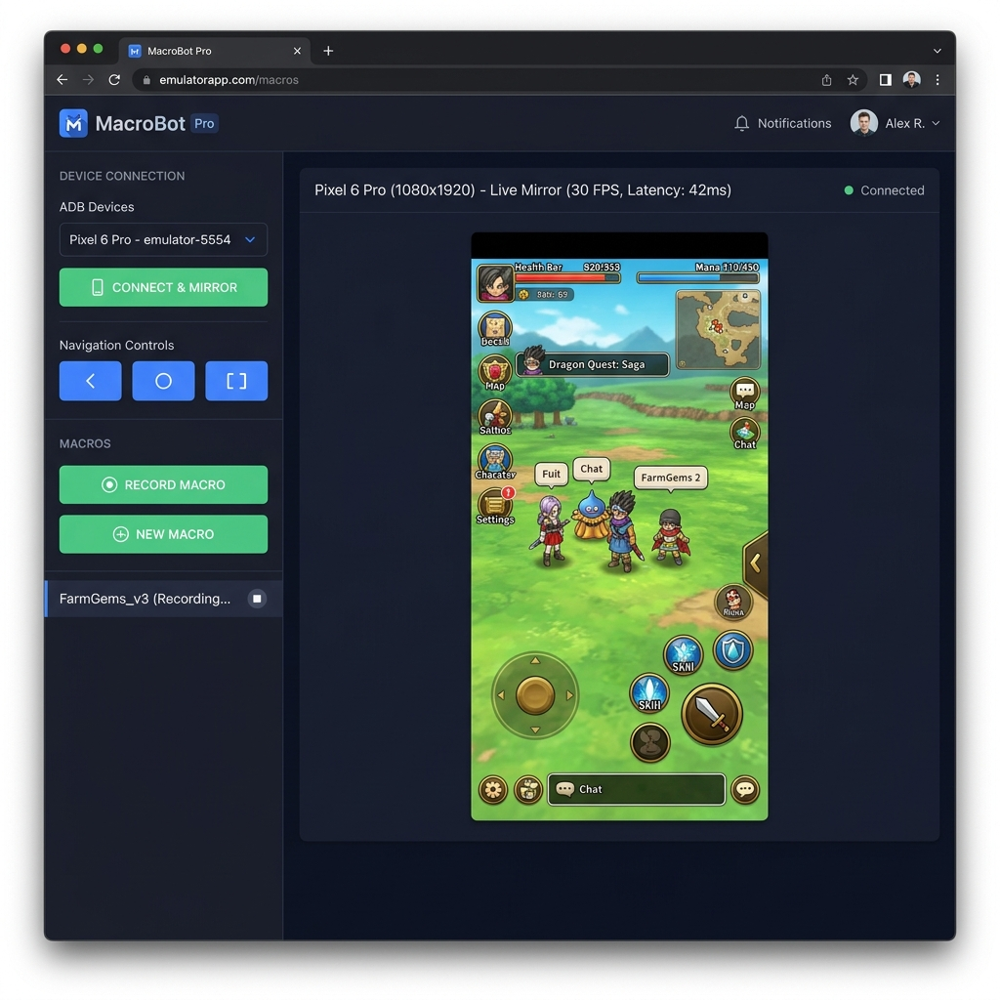
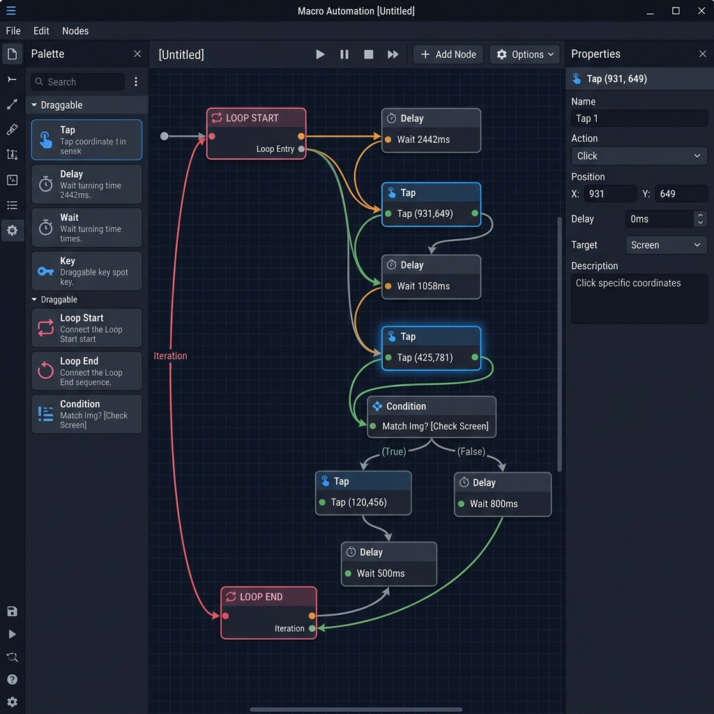

# 🎮 MuMu Player ADB — Advanced Macro GUI

> A powerful, browser-based macro automation tool for MuMu Player (and any Android emulator). Real-time screen mirroring, visual node-graph macro editor, one-click recording, loop systems, anti-cheat randomization, and multi-display support — all from a sleek dark-mode web GUI.



---

## ✨ Features

| Feature | Description |
|---|---|
| **Real-Time Screen Mirror** | 30-60 FPS live mirror of your emulator via scrcpy protocol, streamed to your browser as MJPEG. |
| **Click-to-Tap** | Click anywhere on the mirrored screen and it sends a real tap to the Android device at the correct coordinates. |
| **Visual Node Editor** | Blueprint-style drag-and-drop macro editor with Tap, Delay, Wait, Key, Loop, and Condition nodes. |
| **One-Click Macro Recording** | Hit Record, tap on the screen, and the tool captures every touch with accurate coordinates, timing, and hold durations. |
| **Loop System** | Color-paired Loop Start / Loop End nodes for fixed iterations, infinite loops, time-based, or pixel-color-based loops. |
| **Anti-Cheat Randomization** | Built-in "Simulate Human" mode that randomizes tap coordinates, hold duration, and pre-delay to avoid detection. |
| **Multi-Display Support** | Switch between MuMu's virtual displays (Display 0, 2, 3, etc.) instantly from a dropdown. |
| **Window Capture Mode** | Bypass ADB video entirely — capture MuMu's render window directly via the Windows Graphics Capture API for ultra-low latency. |
| **Color Picker / Dropper** | Pick X,Y coordinates and hex colors directly from the live screen for pixel-based conditions. |
| **Navigation Buttons** | One-click Back, Home, and Recents buttons. |

---

## 📋 Requirements

| Requirement | Version | Notes |
|---|---|---|
| **Python** | 3.10+ | 3.11+ recommended |
| **MuMu Player** | Any | Or any Android emulator accessible via ADB |
| **ADB** | Included | `platform-tools/` is bundled in this repo |
| **OS** | Windows 10/11 | Window Capture mode is Windows-only; ADB mirror works on any OS |

### Python Packages

All packages are listed in `requirements.txt`:

| Package | Purpose |
|---|---|
| `flask` | Web server and API |
| `opencv-python` | Frame encoding (MJPEG stream) |
| `adbutils` | ADB device communication |
| `scrcpy-client` | Real-time screen streaming protocol |
| `numpy` | Frame buffer handling |
| `pywin32` | *(Windows only)* Window enumeration for Window Capture mode |
| `windows-capture` | *(Windows only)* GPU-accelerated window capture |

---

## 🚀 Installation

### 1. Clone the repository

```bash
git clone https://github.com/TeeTyJunGz/MuMu-Player-ADB-AdvanceMacro.git
cd MuMu-Player-ADB-AdvanceMacro
```

### 2. Install Python dependencies

**Option A — pip (simplest):**
```bash
pip install -r requirements.txt
```

**Option B — conda (if you hit build errors with `av`):**
```bash
conda activate MuMuEMU
conda install -c conda-forge "av>=9,<11"
pip install -r requirements.txt
```

### 3. Connect MuMu Player to ADB

MuMu's built-in ADB typically listens on `127.0.0.1:7555` (check MuMu settings → Developer → ADB port if different).

```bash
adb connect 127.0.0.1:7555
adb devices   # Should show "127.0.0.1:7555  device"
```

> **Tip:** If `adb` is not in your PATH, use the bundled one at `platform-tools/adb.exe`.

### 4. Start the server

```bash
python app.py
```

### 5. Open in browser

Navigate to **[http://localhost:5000](http://localhost:5000)** in any modern browser (Chrome/Edge/Firefox).

---

## 📖 How to Use

### 🔌 Connecting to Your Device

1. Click **Refresh device list** — the ADB devices dropdown will populate with all connected devices.
2. Select your device (e.g. `127.0.0.1:7555`).
3. Click **Connect & Mirror** — the live screen feed will appear in the main panel.

Alternatively, type the serial directly into the **Manual connect** field (e.g. `127.0.0.1:16384`) and click **adb connect + use**.

Once connected, **click anywhere** on the mirrored screen to send a real tap to the device.

---

### 🖥️ Mirror Source Modes

#### ADB (scrcpy) — Default
Streams H.264 video from the device over ADB → decodes in Python → re-encodes as MJPEG for the browser. Works over USB or WiFi.

#### Window Capture (Fast) — Windows Only
Captures MuMu's render window directly via the Windows Graphics Capture API. No network hop, no encode/decode — just a direct GPU frame handoff. Significantly lower latency and CPU usage.

To use:
1. Switch the **Mirror source** toggle to **Window Capture**.
2. Click **Refresh windows** to find available MuMu windows.
3. Select the window (e.g. "Android Device").
4. Adjust **Crop top (px)** if needed (default 40px trims MuMu's tab bar).
5. Click **Connect & Capture Window**.

> **Note:** You still need a device serial selected for touch input — window capture only captures pixels; ADB is still used to send taps/swipes.

---

### 📺 Multi-Display Switching

MuMu Player can run multiple apps on separate virtual displays. Once connected:

1. The **Display (Virtual Screens)** dropdown appears automatically in the sidebar.
2. Select the display you want (e.g. Display 2, Display 3).
3. Click **Switch Display** — the mirror will switch to that screen within 1-2 seconds.

All displays run at the same 30-60 FPS performance. Touch input automatically targets the correct display.

---

### ⬅️ Navigation Buttons

The sidebar includes three Android navigation buttons:

| Button | Action | Android Keyevent |
|---|---|---|
| **← Back** | Go back | `KEYCODE_BACK` (4) |
| **● Home** | Go to home screen | `KEYCODE_HOME` (3) |
| **◻ Recents** | Open recent apps | `KEYCODE_APP_SWITCH` (187) |

---

### 🔴 Recording a Macro

1. Click **🔴 Record Macro** in the sidebar.
2. A floating recording panel appears in the top-right corner.
3. **Tap on the mirrored screen** — each tap is recorded with:
   - Exact X,Y coordinates
   - Hold duration (how long you pressed)
   - Time delay between taps
4. Use **+ Add 1s Delay** to insert manual delays.
5. Click **✓ Finish** to save, or **✕ Cancel** to discard.

The recorded actions are automatically converted into nodes in the visual macro editor, laid out left-to-right with proper spacing.

---

### 🔧 Visual Node Editor



After creating or recording a macro, click **Edit** to open the full node editor below the main screen.

#### Node Types

| Node | Description |
|---|---|
| **Tap** | Taps the screen at X,Y coordinates with a configurable hold duration. |
| **Delay** | Waits for a specified number of milliseconds. |
| **Wait** | Waits for a time duration, or until a specific pixel color appears on screen. |
| **Key** | Sends text input or Android keycodes to the device. |
| **Loop Start** | Marks the beginning of a loop. Supports fixed iterations, infinite, time-based, or pixel-color-based conditions. |
| **Loop End** | Marks the end of a loop. Paired to a Loop Start by color. |
| **Condition** | Checks if a pixel at X,Y matches an expected color (with tolerance), then branches to a "true" or "false" path. |

#### Controls

| Action | How |
|---|---|
| **Add a node** | Drag from the palette (left panel) onto the canvas. |
| **Connect nodes** | Click a red output port → click a blue input port on another node. |
| **Select a node** | Click on it. Hold `Ctrl` and click to multi-select. |
| **Select multiple** | Click and drag on empty canvas to lasso-select. |
| **Delete nodes** | Select node(s) and press `Delete` or `Backspace`. |
| **Delete a connection** | Click on the arrow/line between two nodes. |
| **Zoom** | Scroll wheel. |
| **Pan** | Middle mouse button drag. |
| **Rotate node** | Press `R` to rotate a node 90° (changes flow direction). |
| **Fit to view** | Click **⊞ Fit** in the toolbar. |
| **Edit properties** | Click a node → edit values in the right-side properties panel → click **Apply Changes**. |
| **Save** | Click **💾 Save** in the toolbar. |

---

### 🔁 Loop System

The loop system uses a paired **Loop Start** + **Loop End** node architecture:

1. Drag a **Loop Start** node onto the canvas.
2. Drag a **Loop End** node onto the canvas.
3. Assign both the **same color** (e.g. Pink) — this pairs them together.
4. Connect your nodes in order: `Loop Start → Tap → Delay → Tap → Loop End`.
5. Configure the loop condition on the Loop Start node:

| Loop Type | Description |
|---|---|
| **Fixed Count** | Repeats N times (e.g. 5 iterations). |
| **Infinite** | Runs forever until you press Stop. |
| **Until Time** | Runs until a specified time (e.g. 21:00). |
| **Until Color** | Runs until a specific pixel color appears at X,Y on screen. |

You can have **multiple independent loops** by assigning different colors (9 available: Pink, Teal, Orange, Lime, Purple, Cyan, Gold, Rose, Sky).

---

### 🎯 Simulate Human (Anti-Cheat Randomization)

To avoid detection by game anti-cheat systems that look for perfectly repeating tap patterns:

1. Click on a **Tap** node in the node editor.
2. In the properties panel, check **☑ Simulate Human (Randomize)**.
3. Configure the randomization bounds:

| Setting | Description | Example |
|---|---|---|
| **Pre-Delay Min/Max (ms)** | Random pause *before* the tap executes. Mimics human reaction time. | 0 – 50 ms |
| **X Variance (+/- px)** | Random offset applied to the X coordinate. Mimics imprecise finger placement. | ± 5 px |
| **Y Variance (+/- px)** | Random offset applied to the Y coordinate. | ± 3 px |
| **Hold Min/Max (ms)** | Random hold duration for the tap. Mimics varying press lengths. | 20 – 80 ms |

Every time the node executes (including across loop iterations), it generates a **completely unique** combination of pre-delay, position offset, and hold duration within your specified bounds.

> **Example:** A Tap node at (500, 300) with X±5, Y±3, Pre-Delay 0-50ms, Hold 20-80ms might execute as:
> - Iteration 1: wait 23ms → tap (503, 298) for 45ms
> - Iteration 2: wait 8ms → tap (497, 302) for 71ms
> - Iteration 3: wait 41ms → tap (500, 299) for 33ms

---

### ▶️ Running a Macro

1. Open a macro by clicking **Edit** from the macro list.
2. Click **▶ Play** — the macro starts executing on the connected device.
3. The **execution log** at the bottom shows real-time progress:
   - `✅ Tap (931,649)` — successful tap
   - `✅ Wait 2442ms` — delay completed
   - `❌ Timeout` — a wait condition timed out
4. Click **⏹ Stop** to halt execution immediately (even mid-delay).

---

### 📍 Pick & Dropper Tools

When editing a Tap, Wait, or Condition node, you can pick coordinates and colors directly from the live screen:

- **📍 Pick from screen** — Click this button, then click anywhere on the mirrored screen. The X,Y coordinates are automatically filled into the node's properties.
- **🎨 Dropper** — Click this button, then click on the mirrored screen. The hex color of the clicked pixel is captured and a color preview swatch is shown.

> **Important:** These tools work by reading the actual pixel data from the live ADB frame buffer — the coordinates and colors are exact device pixels, not browser-scaled values.

---

## 🏗️ Project Structure

```
MuMuADB/
├── app.py                  # Flask backend — all API routes, scrcpy client, frame streaming
├── requirements.txt        # Python dependencies
├── platform-tools/         # Bundled ADB binaries
├── templates/
│   ├── index.html          # Main web GUI (sidebar + mirror + node editor + all JS logic)
│   ├── macro_panel.html    # Macro list & playback controls (included in index.html)
│   └── macro_recorder.html # Floating recording panel (included in index.html)
├── macros/
│   ├── models.py           # Data models (Macro, MacroNode, Connection, NodeType enums)
│   ├── storage.py          # JSON file I/O for saving/loading macros
│   └── executor.py         # Macro execution engine (loop handling, randomization, ADB commands)
├── macros_data/            # Saved macro JSON files (auto-created)
└── docs/
    └── images/             # Screenshots for README
```

---

## ⚡ Performance Tips

| Tip | Effect |
|---|---|
| Use **Window Capture** mode instead of ADB | Significantly lower latency and CPU usage (Windows only, same-PC only). |
| Connect via **USB** instead of WiFi ADB | Cuts the largest chunk of streaming latency. |
| Lower `JPEG_QUALITY` in `app.py` | Smaller frames = faster encode/transfer (default 70). |
| Lower `bitrate` in `connect_device()` | Less data to encode on-device (default 8Mbps). |
| Set `max_fps=30` | Fewer frames = less CPU pressure on the encoder. |

---

## 🐛 Troubleshooting

| Problem | Solution |
|---|---|
| **Video feed stays blank** | Check terminal for scrcpy errors. Make sure `adb devices` shows your device as "device" (not "offline"). |
| **Device not in dropdown** | Click **Refresh device list**. Run `adb connect 127.0.0.1:7555` manually first. |
| **Display switching says "not available"** | Restart the Python server. The display list is now refreshed on every switch. |
| **Stop button doesn't work** | Restart the Python server to pick up the latest `executor.py` changes. |
| **Window Capture mode unavailable** | Install `pywin32` and `windows-capture` (`pip install pywin32 windows-capture`). Windows only. |
| **Window Capture feed freezes** | Don't minimize MuMu's "Android Device" window — it stops rendering when minimized. |
| **Crop top is wrong** | Adjust the **Crop top (px)** field (default 40). This varies with Windows DPI scaling. |

---

## 📄 License

This project is provided as-is for personal use. See repository for details.
